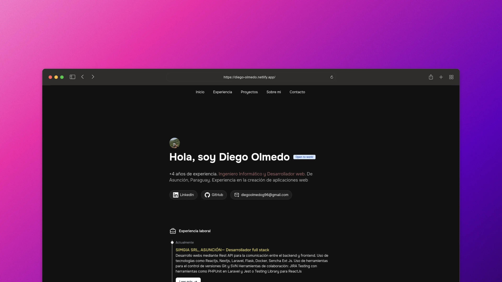

# Portafolio Personal

Este es un proyecto de portafolio personal construido con Astro y Tailwind CSS. Muestra mi experiencia en el desarrollo web, proyectos realizados y estudios académicos.

## 🚀 Estructura del proyecto

Estructura de carpetas del proyecto:

```text
/
├── public/
│   └── favicon.svg
├── src/
│   ├── icons/
│   │
│   ├── components/
│   │   
│   ├── layouts/
│   │  
│   ├── pages/
│   └    
└── package.json
```

## 🧑‍💻 Requisitos previos

- [Node.js](https://nodejs.org/en/) - `v18.17.1` o `v20.3.0` o superior. (`v19` no es compatible) 
- [Bun](https://bun.sh/): Un moderno gestor de paquetes y ejecutor de JavaScript.
- **Editor de texto** - Se recomienda VS Code con la extensión oficial de Astro.
- **Terminal** - Astro se accede a través de su interfaz de línea de comandos (CLI).

[![Node][Node.js]][Nodejs-url] [![Bunjs][Bun.js]][Bunjs-url]


## 🧰 Tecnologías utilizadas

- [Astro](https://astro.build/): Un framework moderno para construir sitios web estáticos.
- [Tailwind CSS](https://tailwindcss.com/): Un framework de CSS utilitario.


## 🥰 Instalación

Install portfolio-astro con bun

```bash
 git clone https://github.com/Olmedo1996/portfolio-astro.git
 cd portfolio-astro
 bun install
```


Todos los comandos se ejecutan desde la raíz del proyecto, desde una terminal:

| Command                   | Action                                           |
| :------------------------ | :----------------------------------------------- |
| `bun install`             | Installs dependencies                            |
| `bun dev`                 | Starts local dev server at `localhost:4321`      |
| `bun build`               | Build your production site to `./dist/`          |
| `bun preview`             | Preview your build locally, before deploying     |
| `bun astro ...`           | Run CLI commands like `astro add`, `astro check` |
| `bun astro -- --help`     | Get help using the Astro CLI                     |


## 📖 Desarrollo

Para iniciar el servidor de desarrollo, ejecuta el siguiente comando:

```bash
 bun dev
```

Luego, abre [http://localhost:3000](http://localhost:3000) en tu navegador para ver el sitio en desarrollo.
## 👀 Construcción para producción

Para generar la versión de producción optimizada, ejecuta:

```sh
bun build
```

Los archivos estáticos compilados estarán disponibles en el directorio `dist`.
<p align="right">(<a href="#readme-top">back to top</a>)</p>


[Astro]: https://img.shields.io/badge/Astro-BC52EE?style=for-the-badge&logo=astro&logoColor=fff
[Astro-url]: https://astro.build/

[TailwindCSS]: https://img.shields.io/badge/Tailwind-06B6D4?style=for-the-badge&logo=TailwindCSS&logoColor=fff
[TailwindCSS-url]: https://astro.build/

[Bun.js]: https://img.shields.io/badge/Bun.Js-000000?style=for-the-badge&logo=bun&logoColor=fff
[Bunjs-url]: https://bun.sh/docs/installation

[Node.js]: https://img.shields.io/badge/Node.Js-5FA04E?style=for-the-badge&logo=bun&logoColor=fff
[Nodejs-url]: https://nodejs.org/en